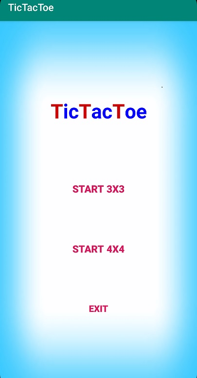
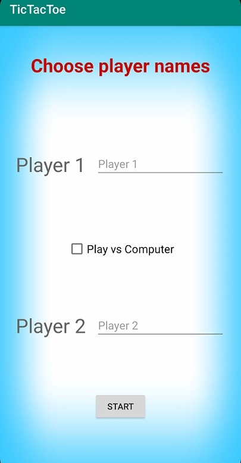
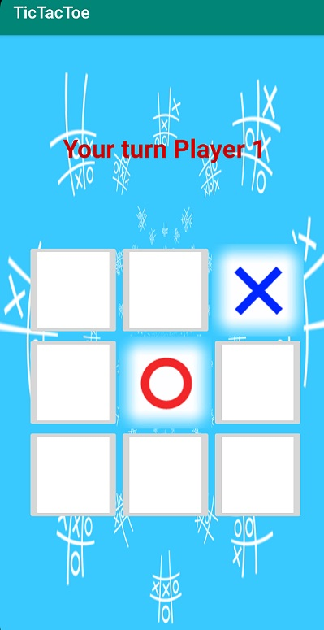

# TicTacToe Offline

Offline Android tic-tac-toe: **3×3** or **4×4**, human vs human or vs computer.

Package ID: `gr.ckaramolegkos.tictactoe`

## Features

- 3×3 and 4×4 boards (win = **3 in a row** on both sizes)
- Play vs a friend or vs the computer
- Computer difficulty when vs AI:
  - **Easy** — random legal moves
  - **Hard** — minimax with alpha-beta pruning
- Landscape layouts for menu / players / game

## Screenshots

### 1. Choose game type


### 2. Enter name


### 3. Play!


## Requirements

- JDK **17**
- Android SDK (compile/target **API 35**, min **API 21**)
- Android Studio Ladybug+ or command-line tools

## Build

```bash
./gradlew assembleDebug
```

APK output:

```text
app/build/outputs/apk/debug/app-debug.apk
```

Unit tests (pure board + AI logic, no device needed):

```bash
./gradlew test
```

## CI

GitHub Actions builds the debug APK, runs unit tests, checks package/activity via `aapt`, and uploads `app-debug` as a workflow artifact on every push and pull request.

## Project layout

```text
app/src/main/java/gr/ckaramolegkos/tictactoe/
  MainActivity.java
  PlayersActivity.java
  GameActivity.java          # single board UI for 3x3 and 4x4
  model/
    Board.java               # pure game rules
    GameAi.java              # easy / hard
    Difficulty.java
```

## License

See [LICENSE.md](LICENSE.md).
